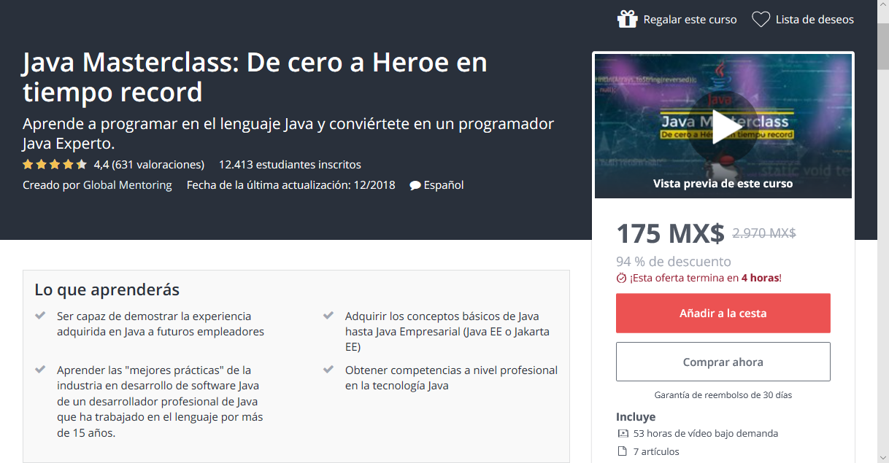

# Ejercicios Java 
Este repositorio contiene todas las practicas del curso “Java Masterclass: De cero a Heroe en tiempo record”, el cual es un curso completo de java, en el cual se adquieren conocimientos básicos de java hasta avanzado/Empresarial (Java EE o Jakarta EE).

Considero este curso muy completo ya que es 100% práctico, pero a la ves 100% teórico, esto ya que cada concepto de java es explicado y llevado a la práctica mediante un ejemplo o dos, dependiendo que tan extenso sea el tema.

En este curso se aprende desde la las bases como: variables, operadores, ciclos, métodos y constructores, uso de palabras reservadas, uso de clases, etc., hasta niveles avanzadas con el manejo de interfaces de escritorio y JSP con Bootstrap 4.

Captura de pantalla del curso en udemy.com



## Java
```java
public class Bienvenido {
	public static void main(String[] args) {
		System.out.println("Bienvenidos a los ejemplos de java");
	}
}
```
---

## Descripción
>A continuación, se muestra un índice del orden en el que pueden ir revisado los ejemplos comenzando desde lo básico a avanzado, en los casos donde el tema sea diferente al nombre de la carpeta se un poco diferente al tema se colocara entre paréntesis el nombre de la carpeta o ejemplo. Por otro lado, solo podrá encontrar los ejemplos con código como referencia, ya que no están las diapositivas de la teoría del curso.

Requisitos
------------

Ejemplos creados en NetBeans, por lo que si quiere probar tal como esta necesitara.
 * NetBeans.
 * Tener instalado el JDK de java.

Sin embargo, los ejemplos están pensados para que no se tenga que utilizar un IDE especifico, así que en todo caso el único requisito indispensable es instalar el JDK de java y pude probar el código en otros IDEs o editores y solo configurar la herramienta que utilice para complicar el código java, a continuación, unos ejemplos de editores:
 * Visual Studio Code.
 * Sublime Text.

## Lista de ejercicios de Java

1. Hola Mundo
2. Variables
3. Operadores (ManejoOperadores, PrecedenciaOperadores)
4. Sentencias de control
5. Ciclos en java
	* 5.1 Ciclo While (CicloWhile)
	* 5.2 Ciclo Do Wile (CicloDoWhile)
	* 5.3 Ciclo For (CicloFor)
6. Tema de clase y objetos (CreacionClasesObjetos)
8. Tema de metodos y constructores en el siguiente order
	- 8.1 Aritmetica <== metodos
	- 8.2 Aritmetica <== constructores
9. Paso por valor y por referencia
	- 9.1 PasoPorValor
	- 9.2 PasoPorReferencia
10. Uso de la palabra return
	- 10.1 return con tipos(PalabraReturn)
	- 10.2 return con clases/objetos(PalabraReturnClases)
11. Uso de la palabra this (PalabraThis)
12. Uso de la palabra null (PalabraNull)
13. Encapsulamiento (Encapsulamiento)
14. Contexto Estatico (EjemploStatic)
15. Herencia en Java (EjemploHerencia)
16. Sobrecarga de constructores en java (SobrecargaConstructores)
17. SObrecarga de metodo en java (SobrecargaMetodos)
18. Uso de paquetes en java (EjemploPaquetes)
19. Uso de palabra Final en java (EjemploPalabraFinal)
20. BLUEJ, esta e suna herramient apara visualizar y comprender un poco mas la parte de programacion orientada a objetos (POO).
21. Manejo de arreglos en java (EjemoploArreglos)
22. Manejo de matrices en Java (EjemploMatrices)
23. Diseño de clases en java (Ventas)
24. Lavoratorio final de fundamentos de java ...


## License (link del curso en udemy)
[CURSO](https://www.udemy.com/java-masterclass-de-cero-a-heroe-en-tiempo-record/)


